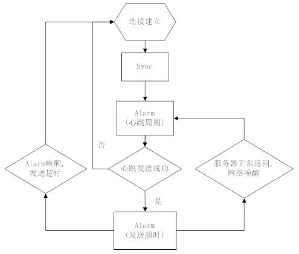
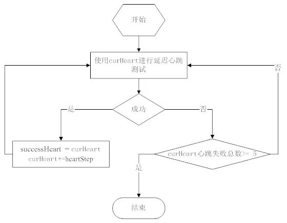

# Android 后台保活

- [网络保活](#h2-1)
- [进程保活](#h2-2)

<h2 id="h2-1">网络保活</h2>

- GCM
- 第三方push通道
- 自身跟服务器通过轮训，或者长连接

### 长连接实现的几个要素

1. 网络切换或者初始化时 server ip 的获取
2. 连接前的 ip筛选，出错后ip 的抛弃
3. 维护长连接的心跳
4. 服务器通过长连notify
5. 选择使用长连通道的业务
6. 断开后重连的策略

### 心跳机制

心跳的目的很简单：通过定期的数据包，对抗NAT超时。以下是部分地区网络NAT 超时统计：

地区 | NAT 超时时间
--- | ----------
中国移动3G和2G | 5分钟
中国联通2G | 5分钟
中国电信3G | 大于28分钟
美国3G | 大于28分钟
台湾3G | 大于28分钟

老版本微信4.5分钟发送一次心跳。心跳实现：

a. 连接后主动到服务器Sync拉取一次数据，确保连接过程的新消息

b. 心跳周期的Alarm 唤醒后，一般有几秒的cpu 时间，无需wakelock

c. 心跳后的Alarm防止发送超时，如服务器正常回包，该Alarm 取消

d. 如果服务器回包，系统通过网络唤醒，无需wakelock

### 动态心跳

4.5min心跳周期是稳定可靠的，但无法确定是最大值。通过终端的尝试，可以获取到特定用户网络下，心跳的最大值。

引入该特性的背景：

a. 运营商的信令风暴

b. 运营商网络换代，NAT超时趋于增大

c. Alarm耗电，心跳耗流量。

动态心跳引入下列状态：

a. 前台活跃态：亮屏，微信在前台，  周期minHeart (4.5min) ，保证体验。

b. 后台活跃态：微信在后台10分钟内，周期minHeart ，保证体验。

c. 自适应计算态：步增心跳，尝试获取最大心跳周期(sucHeart)。

d. 后台稳定态：通过最大周期，保持稳定心跳。

自适应计算态流程：

在自适应态：

a. curHeart初始值为minHeart ， 步增(heartStep)为1分钟。

b. curHeart 失败5次， 意味着整个自适应态最多只有5分钟无法接收消息。

c. 结束后，如果sucHeart > minHeart，会减去10s(避开临界)，为该网络下的稳定周期。

d. 进入稳定态时，要求连接连续三次成功minHeart心跳周期，再使用sucHeart。

稳定态的退出：

sucHeart 会对应网络存储下来， 重启后正常使用。考虑到网络的不稳定，如NAT超时变小，用户地理位置变换。当发现sucHeart 连续5次失败， sucHeart 置为minHeart ，重新进入自适应态。

### notify 机制

**Sync**

通过Sync CGI直接请求后台数据。Sync 通过后台和终端的seq值对比，判断该下发哪些消息。终端正常处理消息后，seq更新为最新值。

Sync 的主要场景：

a. 长连无法建立时，通过Sync 定期轮询

b. 微信切到前台时，触发Sync(保命机制)

c. 长连建立完成，立即触发Sync，防止连接过程漏消息

d. 接收到Notify 或者 gcm 后，终端触发Sync 接收消息.

**Notify**

类似于GCM。通过长连接，后台发出仅带seq的小包，终端根据seq决定是否触发Sync拉取消息。

**NotifyData**

在长连稳定， Notify机制正常的情况下(保证seq的同步)。后台直接推送消息内容，节省1个RTT (Sync) 消息接收时间。终端收到内容后，带上seq回应NotifyAck，确认成功。这里会出现Notify和NotifyData状态互相切换的情况：

如NotifyData 后，服务器在没收到NotifyAck，而有新消息的情况下，会切换回到Notify，Sync可能需要冗余之前NotifyData的消息。终端要保证串行处理NotifyData和Sync ，否则seq可能回退。

**GCM**

只要机器上有GMS ，启动时就尝试注册GCM，并通知后台。服务器会根据终端是否保持长连，决定是否由GCM通知。GCM主要针对国外比较复杂的网络环境。

<h2 id="h2-2">进程保活</h2>

在Android系统里，进程被杀的原因通常为以下几个方面：

a. 应用Crash

b. 系统回收内存

c. 用户触发

d. 第三方root权限app.

原因a可以单独作为一个课题研究。原因c、d目前在微信上没有特殊处理。这里讨论的就是如何应对Android Low Memory Killer。

几个微信保活的方法：

### 进程拆分

a. push主要用于网络交互，没有UI

b. worker就是用户看到的主要UI

c. tools主要包含gallery和webview

### 及时拉起

系统回收不可避免，及时重新拉起的手段主要依赖系统特性。从上图看到， push有AlarmReceiver， ConnectReceiver，BootReceiver。这些receiver 都可以在push被杀后，重新拉起。特别AlarmReceiver ，结合心跳逻辑，微信被杀后，重新拉起最多一个心跳周期。

而对于worker，除了用户UI操作启动。在接收消息，或者网络切换等事件， push也会通过LocalBroadcast，重新拉起worker。这种拉起的worker ，大部分初始化已经完成，也能大大提高用户点击微信的启动速度。

### 进程优先级

提高进程优先级是保活的最好手段。

原理：Android 的前台service机制。但该机制的缺陷是通知栏保留了图标。

对于 API level < 18 ：调用startForeground(ID， new Notification())，发送空的Notification ，图标则不会显示。

对于 API level >= 18：在需要提优先级的service A启动一个InnerService，两个服务同时startForeground，且绑定同样的 ID。Stop 掉InnerService ，这样通知栏图标即被移除。

这方案实际利用了Android前台service的漏洞。微信在评估了国内不少app已经使用后，才进行了部署。其实目标是让大家站同一起跑线上，哪天google 把漏洞堵了，效果也是一样的。

## 参考

- [微信Android客户端后台保活经验分享](http://www.infoq.com/cn/articles/wechat-android-background-keep-alive)
- [关于 Android 进程保活，你所需要知道的一切](http://www.jianshu.com/p/63aafe3c12af)
