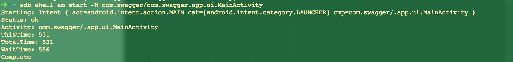

# Android 计算App启动时间

## adb shell

`adb shell am start -W com.xxx/com.xxx.xxx.MainActivity`

- `WaitTime` 表示总的耗时，包括前一个应用 Activity pause 的时间和新应用启动的时间
- `ThisTime` 表示一连串启动 Activity 的最后一个Activity 的启动时间
- `TotalTime` 表示新应用启动耗时，包括新进程的启动和 Activity 的启动，但不包括前一个应用 Activity pause 的耗时。也就是说，开发者一般只要关心 TotalTime 即可，这个才是自己应用真正的启动耗时

`adb shell am start -W ` 的实现在 frameworks\base\cmds\am\src\com\android\commands\am\Am.java 文件中。其实就是跨Binder调用ActivityManagerService.startActivityAndWait() 接口（后面将ActivityManagerService简称为AMS），这个接口返回的结果包含上面打印的ThisTime、TotalTime时间.

WaitTime = endTime - startTime

- startTime记录的刚准备调用startActivityAndWait()的时间点
- endTime记录的是startActivityAndWait()函数调用返回的时间点
- WaitTime = startActivityAndWait()调用耗时。

ThisTime、TotalTime 的计算在 frameworks\base\services\core\java\com\android\server\am\ActivityRecord.java 文件的 reportLaunchTimeLocked() 函数中。

- curTime 表示该函数调用的时间点.
- displayStartTime 表示一连串启动Activity中的最后一个Activity的启动时间点.
- mLaunchStartTime 表示一连串启动Activity中第一个Activity的启动时间点.

## 参考

[Android 中如何计算 App 的启动时间？](http://www.androidperformance.com/2015/12/31/How-to-calculation-android-app-lunch-time/)
