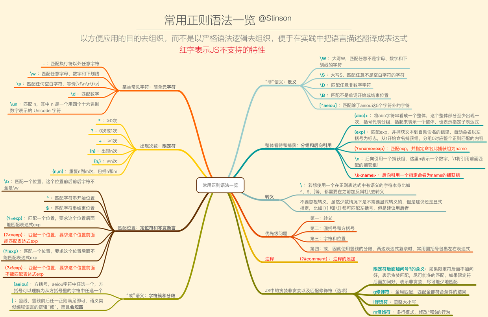

# 正则表达式

## 常用语法

### 某类常见字符 ，简单元字符
`.` 匹配换行符以外任意字符
`\w` 匹配任意字母、数字和下划线
`\s` 匹配任何空白字符，等价[\f\n\r\t\v]
`\d` 匹配数字
`\un` 匹配n，其中n是一个用四个十六进制数字表示的Unicode字符
 

## 参考

- [JS正则表达式一条龙讲解，从原理和语法到JS正则、ES6正则扩展，最后再到正则实践思路](https://segmentfault.com/a/1190000008088937)